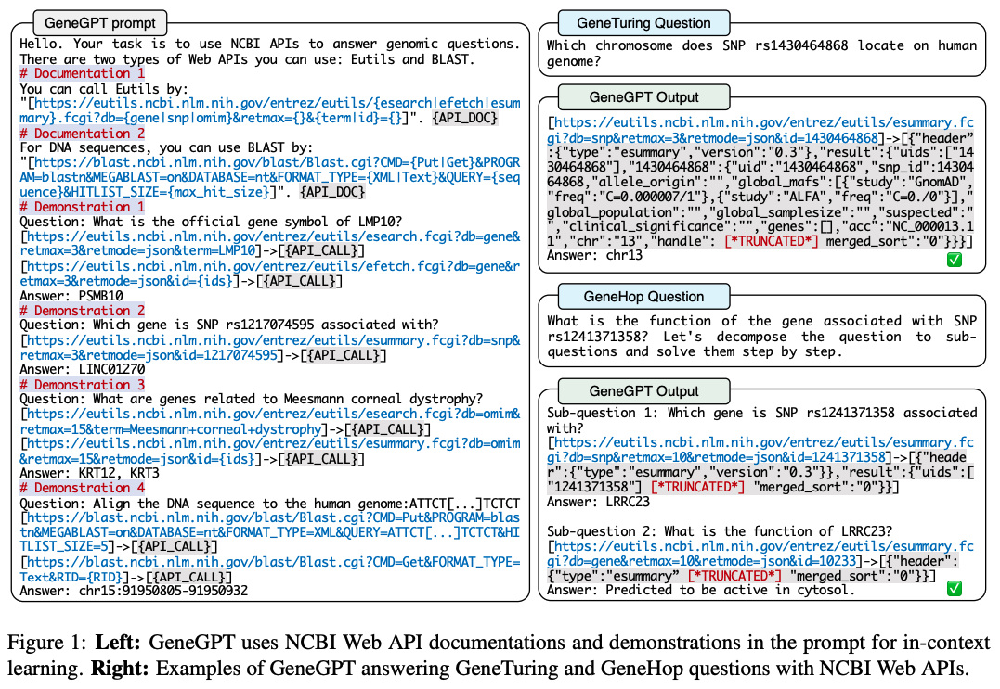

# Module 3: Applying/exploiting Large Language Models

This week we will be learning about how to benchmark and evaluate LLMs with principled software engineering techniques while learning about the complexities of distributed systems.

[__Detailed Syllabus__](SYLLABUS.md)

## Task

We will focus on re-implementing the GeneGPT paper from the NCBI.
* [Paper](https://academic.oup.com/bioinformatics/article/40/2/btae075/7606338)
* [Code](https://github.com/ncbi/GeneGPT)



## Timeline

| Day | Task | Description |
| --- | --- | --- |
| 1 | [Ollama + GeneTuring](day1/README.md)  | Setup the initial harness code, tracking on one model, dataset |
| 2 | [+ OpenAI + GeneHop](day2/README.md) | Add new model and dataset, explore prompting strategies|
| 3 | [+ Tools](day3/README.md)  | Improve model performance with domain specific tool use |
| 4 | [Hack away](day4/README.md) | Refine the code base and add enchancements that you choose/present |

## Setup

### Requirements

```bash
git clone <this repo>
cd Module_3_materials
python -m venv venv
source venv/bin/activate
pip install -r requirements.txt
```